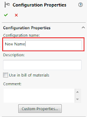

This macro renames all configurations of assembly or part into the value of the specified configuration specific custom property.

Run the macro and enter the name of the custom property to read the value from
Macro will traverse all configurations and rename them based on the corresponding value of the configuration specific custom property
If property doesn't exist in configuration or value is empty - configuration is not renamed

